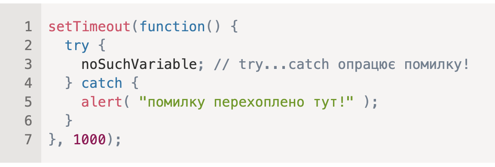

Якщо виключення трапляється у “запланованому до виконання” коді, як setTimeout, тоді try...catch не зможе перехопити помилку;

Щоб перехопити виключення всередині функції запланованої до виконання, try...catch повинен бути всередині цієї функції:

Для всіх вбудованих помилок об’єкт помилки має дві головні властивості:

#### name
Назва помилки. Наприклад, для невизначеної змінної назва буде "ReferenceError".
#### message
Текстове повідомлення з додатковою інформацією про помилку.
Існують інші властивості, що доступні в більшості оточень. Одна з найуживаніших та часто підтримується:

#### stack
Поточний стек викликів: рядок з інформацією про послідовність вкладених викликів, що призвели до помилки. Використовується для налагодження.

## Створення та викидання власних типів помилок

Також ми можемо генерувати власні помилки за допомогою оператору throw. Технічно, будь-що можна передати аргументом в throw, але, зазвичай, використовується об’єкт, успадкований від вбудованого класу Error. 

let json = '{ "age": 30 }'; // неповні дані

try {

  let user = JSON.parse(json); // <-- немає помилки

  if (!user.name) {
    throw new SyntaxError("Неповні дані: відсутнє поле name"); // (*)
  }

  alert( user.name );

} catch (err) {
  alert( "JSON Error: " + err.message ); // JSON Error: Неповні дані: відсутнє поле name
}

Повторне викидання – важливий шаблон в роботі з помилками: переважно блок catch знає як обробляти помилки певного типу, тому він повинен знову викидати невідомі типи помилок.

Навіть, якщо ми не використовуємо try...catch, більшість середовищ дозволяють встановити “глобальний” обробник помилок. В браузерах це window.onerror.